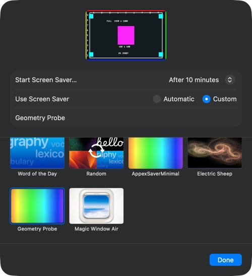

# Settings geometry audit

Tested 2026-09-23 on macOS 26.5.1 (25F80), Apple Silicon, 1920×1080-point display with backing scale 2. This is a disposable diagnostic, not a product change.

## Measured result

The large selected-saver image **compresses a 16:9 source horizontally by about 10% relative to its height**. It shows the full calibration card in a roughly 16:10 rectangle. This reproduces without SwiftTerm, Metal, a PTY, or tslime.

| Capture | Source bounds | Inferred destination, screenshot pixels | Horizontal / vertical scale |
| --- | --- | --- | --- |
| Matching offscreen reference | 1920×1080 | 1920×1080 | 1.000 |
| First Settings selection | 1920×1080 | 159.61×99.77 | 0.900 |
| Reselection after original saver | 1920×1080 | 159.61×100.10 | 0.897 |

Measurements use the centers of four 100×100 cyan markers at known source coordinates. A 400×400 magenta square provides a visual cross-check. All four corners, colored edges and the 5% inset remain visible: there is no substantial crop in this extension test. Screenshot resampling and subpixel boundaries limit precision; treat the result as approximately 10%, not three-decimal accuracy. The 160×100 values are **capture pixels**, not an independently measured AppKit view frame. The aspect ratio and relative axis scaling are the decisive quantities.



The full-size instance logs `preview=0`, `bounds=1920×1080`, `backing=2`; the visible card says `FULL 1920 x 1080`. Logs from both selections are in [observations.txt](observations.txt). The separate true instance still exists but does not supply this image. The previous [routing comparison](../routing-probe/README.md) tested the public legacy integration separately; this geometry test uses the product's private extension handshake. Do not attribute these exact geometry numbers to the legacy test.

## Prototype mismatch

The original browser study assumed a **190×100** slot (1.9:1); Settings measures approximately **160×100** (1.6:1) in the captured sheet. At equal height the real slot is about 16% narrower than that mockup.

There was an additional known rendering transform: `Thumbnail.swift` renders C's 64×20 cells at 10×19 points (640×380, aspect 1.684), then draws it into 380×200 (aspect 1.9) without preserving aspect ratio. That widens the source by about 12.8% relative to its height. These are prototype limitations, not evidence that C is deployed. C remains unimplemented in the large selected-saver image because the earlier true-instance changes targeted the wrong path.

The prototype also explicitly requests a 4-column/1-row matte. Current product theme arguments do not request those overrides. The engine's simple-frame defaults and the full-size grid differ from the coarse-grid study; this audit does not assign every visible inset discrepancy to macOS. Future visual comparisons must use the measured slot, the actual engine arguments and the actual renderer.

## Presentation trace

Read-only inspection of Apple's `Wallpaper.appex` found a `LiveWallpaperView` that takes a private `WallpaperDisplayAssertion.layer`, sizes it to its backing layer's bounds, and adds it as a sublayer. A separate call in the `LegacyScreenSaverOptionsView` region preloads a ScreenSaver module at zero frame with `isPreview=true`. The source marker, preload error text and neighboring configuration-sheet calls strongly suggest options preloading; every consumer of the retained legacy view was not exhaustively traced.

The host also uses `WallpaperDisplayAttributes.isPreview`, which is a **different API flag** from `ScreenSaverView.isPreview`. Its presence does not give the saver a new handshake field. Reproducible commands, UUIDs, addresses, excerpts and limits are in [presentation-trace.md](presentation-trace.md). The main agent independently checked the decisive preload and layer-sizing excerpts.

No saver-owned control for the selected image's layer or composition was found in this bounded audit. The result does not prove every alternate mechanism impossible. It does mean there is no concrete isolated candidate to test now. Applying inverse stretching or the 64×20 grid to every false instance would also affect the saver composition, which is outside this preview-only change.

## Reproduce and verify

1. `python3 build.py` compiles a separate `local.oozel.geometry-probe.host.appex` and writes `reference.png` using the exact same AppKit drawing function. Requires the macOS SDK. Nothing is installed or selected by the build.
2. Register `build/Geometry Probe Host.app` with Launch Services and its embedded extension with `pluginkit -a`.
3. Open System Settings → Wallpaper → Screen Saver → Other → Show All. Scroll to Geometry Probe and select it. This changes only the selected saver temporarily; it does not start a full-screen session.
4. Capture the sheet through System Settings. Native automation must act on `/System/Library/ExtensionKit/Extensions/Wallpaper.appex`; targeting the extension by its bundle ID timed out here. The parent Settings handle can read the sheet but its saver-tile clicks may do nothing.
5. With Python and Pillow available, run:

   ```sh
   python3 measure.py reference.png --verify-uniform
   python3 measure.py settings-capture.png --settings --verify-uniform
   python3 measure.py settings-repeat.png --settings --verify-uniform
   ```

   The reference exits 0. Both real captures exit 1 with `FAIL: horizontal scale is 0.900` / `0.897 of vertical scale`. This replays measurements of the actual Settings output; it does not launch Settings itself. JSON evidence is checked in alongside the captures.
6. Restore the original saver and verify it animates. Close the picker, unregister the extension and host, and check for remaining probe processes.

Cleanup completed: AppexSaverMinimal restored and its animation observed; geometry extension registration removed; no Geometry Probe processes remained. No full-screen saver session ran. Normal product source/build were not changed.

## Online follow-up

The [community research](community-code-research.md) found a shipped adjacent scaling fix (remove the saver root’s explicit autoresizing mask), an experimental lock-state preview heuristic, and an iScreensaver vendor claim of fixed preview mode. The root-mask control should be tested before treating our distortion as entirely host-caused; the product does not explicitly set that mask, while this probe does. None is yet a verified fix for this product’s selected image.

## Next decision

The evidence is ready for Apple: [feedback-draft.md](feedback-draft.md), **not submitted**. It asks about aspect preservation and a supported preview-specific route, distinguishing the public legacy reproduction from the private extension geometry test. Keep the Wayfinder ticket open. The owner chose C's coarse appearance, but the platform path needed to implement it independently remains unverified.
